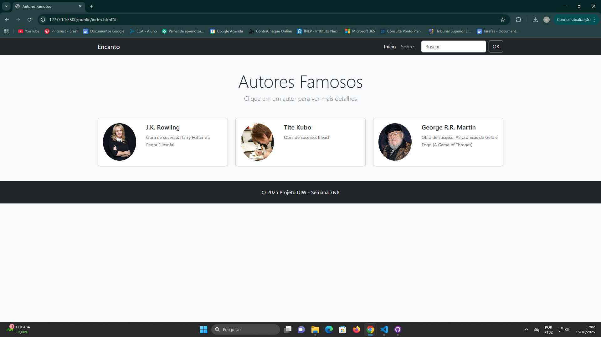
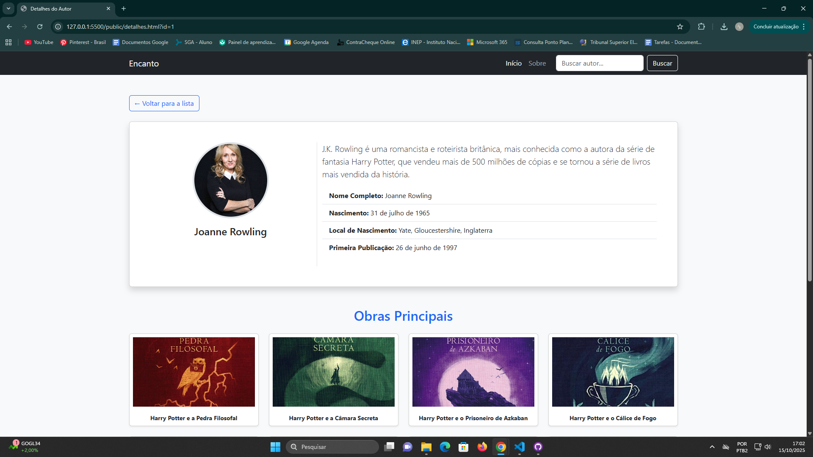

[](https://classroom.github.com/online_ide?assignment_repo_id=20738406&assignment_repo_type=AssignmentRepo)
# Trabalho Prático 05 - Semanas 7 e 8

**Páginas de detalhes dinâmicas**

Nessa etapa, vamos evoluir o trabalho anterior, acrescentando a página de detalhes, conforme o  projeto escolhido. Imagine que a página principal (home-page) mostre um visão dos vários itens que existem no seu site. Ao clicar em um item, você é direcionado pra a página de detalhes. A página de detalhe vai mostrar todas as informações sobre o item do seu projeto. seja esse item uma notícia, filme, receita, lugar turístico ou evento.

Leia o enunciado completo no Canvas. 

**IMPORTANTE:** Assim como informado anteriormente, capriche na etapa pois você vai precisar dessa parte para as próximas semanas. 

**IMPORTANTE:** Você deve trabalhar e alterar apenas arquivos dentro da pasta **`public`,** mantendo os arquivos **`index.html`**, **`styles.css`** e **`app.js`** com estes nomes, conforme enunciado. Deixe todos os demais arquivos e pastas desse repositório inalterados. **PRESTE MUITA ATENÇÃO NISSO.**

## Informações Gerais

- Nome: Ana Luiza Gomes Rodrigues
- Matricula: 902081
- Proposta de projeto escolhida: Artistas/Escritores e Obras
- Breve descrição sobre seu projeto: Uma página para obter informações sobre escritores e suas obras.

## Print da Home-Page



## Print da página de detalhes do item



## Cole aqui abaixo a estrutura JSON utilizada no app.js

```javascript
const authorsData = [
    {
        id: 1,
        fullName: "Joanne Rowling",
        name: "J.K. Rowling",
        image: "img/Harry Potter/J.K.jpg", 
        birthDate: "31 de julho de 1965",
        birthCity: "Yate, Gloucestershire, Inglaterra",
        firstPublicationDate: "26 de junho de 1997",
        mostSuccessfulWork: "Harry Potter e a Pedra Filosofal",
        summary: "J.K. Rowling é uma romancista e roteirista britânica, mais conhecida como a autora da série de fantasia Harry Potter, que vendeu mais de 500 milhões de cópias e se tornou a série de livros mais vendida da história.",
        works: [
            { title: "Harry Potter e a Pedra Filosofal", coverImage: "img/Harry Potter/HPFilosofal.jpg" },
            { title: "Harry Potter e a Câmara Secreta", coverImage: "img/Harry Potter/HPCamara.jpg" },
            { title: "Harry Potter e o Prisoneiro de Azkaban", coverImage: "img/Harry Potter/HPPrisioneiro.jpg" },
            { title: "Harry Potter e o Cálice de Fogo", coverImage: "img/Harry Potter/HPCalice.jpg" },
            { title: "Harry Potter e a Ordem da Fênix", coverImage: "img/Harry Potter/HPOrdem.jpg" },
            { title: "Harry Potter e o Enigma do Príncipe", coverImage: "img/Harry Potter/HPEnigma.jpg" },
            { title: "Harry Potter e as Relíquias da Morte", coverImage: "img/Harry Potter/HPReliquias.png" },
            { title: "Morte Súbita (The Casual Vacancy)", coverImage: "img/Harry Potter/Subita.jpg" },
            { title: "Os Contos de Beedle, o Bardo", coverImage: "img/Harry Potter/Beedle.jpg" },
        ]
    },
    {
        id: 2,
        fullName: "Noriaki Kubo",
        name: "Tite Kubo",
        image: "img/Bleach/Tite Kubo.jpg", 
        birthDate: "26 de junho de 1977",
        birthCity: "Fuchū, Hiroshima, Japão",
        firstPublicationDate: "1999 (Zombiepowder.)",
        mostSuccessfulWork: "Bleach",
        summary: "Noriaki Kubo, conhecido pelo pseudônimo Tite Kubo, é um mangaká japonês. Ele é mundialmente famoso por sua série de mangá Bleach, que foi serializada de 2001 a 2016 e vendeu mais de 130 milhões de volumes globalmente.",
        works: [
            { title: "Bleach - Volume 1", coverImage: "img/Bleach/Capa.jpg" },
            { title: "Bleach - The Death and the Strawberry", coverImage: "img/Bleach/Death.jpg" },
            { title: "Burn the Witch", coverImage: "img/Bleach/Burn.jpg" },
            { title: "Zombiepowder. - Volume 1", coverImage: "img/Bleach/Zombie.jpg" }
        ]
    },
    {
        id: 3,
        fullName: "George Raymond Richard Martin",
        name: "George R.R. Martin",
        image: "img/Gelo&Fogo/George RR Martin.jpg", 
        birthDate: "20 de setembro de 1948",
        birthCity: "Bayonne, Nova Jersey, EUA",
        firstPublicationDate: "1971 (The Hero)",
        mostSuccessfulWork: "As Crônicas de Gelo e Fogo (A Game of Thrones)",
        summary: "George R.R. Martin é um escritor e roteirista americano de fantasia e ficção científica. Ele é mais conhecido pela série de livros 'As Crônicas de Gelo e Fogo', adaptada para a aclamada série de TV 'Game of Thrones'.",
        works: [
            { title: "A Guerra dos Tronos", coverImage: "img/Gelo&Fogo/Tronos.jpg" },
            { title: "A Fúria dos Reis", coverImage: "img/Gelo&Fogo/Furia.jpg" },
            { title: "A Morte da Luz", coverImage: "img/Gelo&Fogo/Morte.jpg" },
            { title: "O Cavaleiro dos Sete Reinos", coverImage: "img/Gelo&Fogo/Cavaleiro.jpg" },
        ]
    }
];
 if (document.getElementById('authors-list')) {
    const authorsListDiv = document.getElementById('authors-list');

    authorsData.forEach(author => {
        const colDiv = document.createElement('div');
        colDiv.className = 'col-lg-4 col-md-6';

        const cardLink = document.createElement('a');
        cardLink.href = `detalhes.html?id=${author.id}`;
        cardLink.className = 'text-decoration-none text-dark';
        
        cardLink.innerHTML = `
            <div class="card author-card h-100 shadow-sm">
                <div class="row g-0">
                    <div class="col-4 d-flex align-items-center justify-content-center p-3">
                        
                    </div>
                    <div class="col-8">
                        <div class="card-body">
                            <h5 class="card-title">${author.name}</h5>
                            <p class="card-text"><small class="text-muted">Obra de sucesso: ${author.mostSuccessfulWork}</small></p>
                        </div>
                    </div>
                </div>
            </div>
        `;
        
        colDiv.appendChild(cardLink);
        authorsListDiv.appendChild(colDiv);
    });
}


if (document.getElementById('author-details-container')) {
    const params = new URLSearchParams(window.location.search);
    const authorId = parseInt(params.get('id'));

    const container = document.getElementById('author-details-container');

    if (authorId) {
        const author = authorsData.find(a => a.id === authorId);

        if (author) {
            const worksHTML = author.works.map(work => `
                <div class="col-6 col-md-4 col-lg-3 mb-4 text-center">
                    <div class="card h-100 shadow-sm">
                        
                        <div class="card-body p-2">
                            <p class="card-text small m-0"><strong>${work.title}</strong></p>
                        </div>
                    </div>
                </div>
            `).join('');


            container.innerHTML = `
                <div class="card shadow mb-5">
                    <div class="card-body p-5">
                        <div class="row">
                            <div class="col-md-4 text-center border-end">
                                
                                <h2 class="h4">${author.fullName}</h2>
                            </div>
                            <div class="col-md-8">
                                <p class="lead">${author.summary}</p>
                                <ul class="list-group list-group-flush mb-4">
                                    <li class="list-group-item"><strong>Nome Completo:</strong> ${author.fullName}</li>
                                    <li class="list-group-item"><strong>Nascimento:</strong> ${author.birthDate}</li>
                                    <li class="list-group-item"><strong>Local de Nascimento:</strong> ${author.birthCity}</li>
                                    <li class="list-group-item"><strong>Primeira Publicação:</strong> ${author.firstPublicationDate}</li>
                                </ul>
                            </div>
                        </div>
                    </div>
                </div>
                
                <h2 class="mb-4 text-center text-primary">Obras Principais</h2>
                <div class="row">
                    ${worksHTML}
                </div>
            `;
        } else {
            container.innerHTML = `<div class="alert alert-danger" role="alert">Autor não encontrado.</div>`;
        }
    } else {
        container.innerHTML = `<div class="alert alert-warning" role="alert">ID do autor não especificado.</div>`;
    }
}